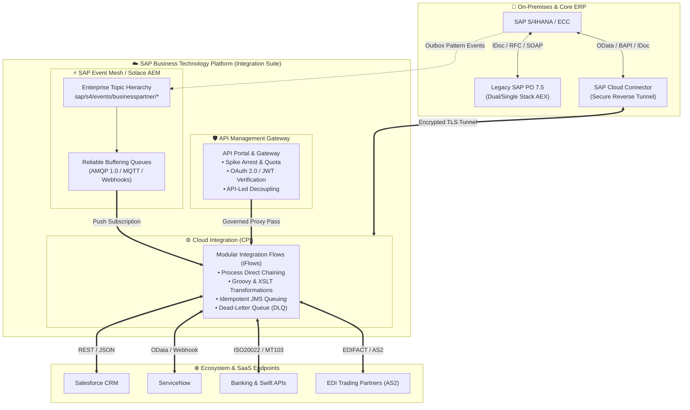

<div align="center">

# Hi there, I'm **Adarsh** 👋
### **SAP Integration Architect & BTP Specialist**
#### *Enterprise Application Integration • SAP Integration Suite • SAP PO/PI • Event-Driven Architecture • API Management*

<p align="center">
  <a href="https://linkedin.com/in/"></a>
  <a href="https://community.sap.com/"></a>
  <a href="mailto:adarshbabumk1@gmail.com"></a>
  
</p>

---

```yaml
specialization: "Hybrid Enterprise Integration & Cloud Modernization"
cloud_stack:    ["SAP BTP Integration Suite", "Cloud Integration (CPI)", "API Management", "SAP Event Mesh"]
on_prem_stack:  ["SAP PO/PI 7.5 (Single-Stack AEX)", "SAP PI Dual-Stack", "SAP S/4HANA & ECC 6.0"]
core_philosophy: "Decoupled, Resilient, Event-Driven & API-First Enterprise Architecture"
```

---

</div>

## 📌 Executive Summary

I am an **Enterprise Integration Architect & Senior Consultant** with extensive experience designing and implementing mission-critical integration solutions connecting **SAP (S/4HANA, ECC, SuccessFactors, Ariba, C4C)** and **Non-SAP (Salesforce, ServiceNow, Workday, Third-Party Banks, Logistics Providers)** systems.

My expertise spans the entire integration lifecycle:
* **SAP Integration Suite (BTP):** Cloud Integration (CPI), API Management (APIM), SAP Event Mesh / Advanced Event Mesh, Open Connectors, Integration Advisor (MAG/MIG).
* **Legacy SAP PO/PI:** Architecture & administration of SAP PI 7.1/7.31/7.4 Dual-Stack and SAP PO 7.5 Single-Stack (Java AEX / NW BPM).
* **PO/PI to Cloud Integration Migration:** Strategy, end-to-end artifact modernization (ICOs to iFlows, RFC/IDoc to OData/REST, UDFs to Groovy/Script Collections, Directory API automation).
* **Event-Driven & API-First Architecture:** CloudEvents standard, AsyncAPI, webhook consumers, OAuth 2.0 security policies, and high-throughput queuing.

---

## 🛠️ Technology & Skill Matrix

<table>
  <tr>
    <td width="20%" valign="top"><strong>Cloud Integration</strong></td>
    <td width="80%">
      
      
      
      
      
    </td>
  </tr>
  <tr>
    <td width="20%" valign="top"><strong>API & Event Mesh</strong></td>
    <td width="80%">
      
      
      
      
      
    </td>
  </tr>
  <tr>
    <td width="20%" valign="top"><strong>Legacy SAP PO / PI</strong></td>
    <td width="80%">
      
      
      
      
      
    </td>
  </tr>
  <tr>
    <td width="20%" valign="top"><strong>Protocols & Adapters</strong></td>
    <td width="80%">
      
      
      
      
      
      
      
      
    </td>
  </tr>
  <tr>
    <td width="20%" valign="top"><strong>Languages & Scripting</strong></td>
    <td width="80%">
      
      
      
      
      
      
    </td>
  </tr>
  <tr>
    <td width="20%" valign="top"><strong>Security & Operations</strong></td>
    <td width="80%">
      
      
      
      
      
    </td>
  </tr>
</table>

---

## 🏛️ Hybrid Enterprise Architecture Blueprint



---

## 📂 Featured Enterprise Showcase Repositories

Explore my deep-dive sample repositories designed as comprehensive architectural references:

| Repository | Focus Area | Key Concepts Demonstrated | Direct Link |
| :--- | :--- | :--- | :--- |
| 🚀 **[sap-cpi-pipo-migration-blueprints](projects/01-sap-cpi-pipo-migration-blueprints)** | **SAP CPI vs PO/PI** | Complete migration matrix, Java UDF to Groovy 3.0 conversion, XSLT 3.0, dynamic routing, exception subprocess framework, and reusable iFlow templates. | [Explore Repo →](projects/01-sap-cpi-pipo-migration-blueprints) |
| 🛡️ **[sap-api-management-enterprise-hub](projects/02-sap-api-management-enterprise-hub)** | **API Management** | Production policy bundles (SpikeArrest, Quota, OAuth2, CORS), OpenAPI 3.0 specs, JWT token extraction, and API-led mediation architecture. | [Explore Repo →](projects/02-sap-api-management-enterprise-hub) |
| ⚡ **[sap-event-mesh-eda-showcase](projects/03-sap-event-mesh-eda-showcase)** | **Event-Driven Architecture** | CloudEvents 1.0 schema compliance, AMQP 1.0 pub/sub simulator, idempotent receiver pattern, DLQ management, and S/4HANA event triggers. | [Explore Repo →](projects/03-sap-event-mesh-eda-showcase) |
| 🏛️ **[sap-pipo-legacy-reference](projects/04-sap-pipo-legacy-reference)** | **SAP PO / PI 7.5** | Classical dual/single stack AEX patterns, File Content Conversion (FCC) cheat-sheet, Java UDF library (Context/Queue cache, RFC lookups), and ICO design. | [Explore Repo →](projects/04-sap-pipo-legacy-reference) |

---

## 🔄 Quick Architectural Comparison: SAP PO/PI vs. SAP Integration Suite

| Dimension | Legacy SAP PO/PI 7.5 | Modern SAP Integration Suite (CPI / APIM / Event Mesh) |
| :--- | :--- | :--- |
| **Hosting Model** | On-Premises (Dual-Stack ABAP+Java or Single-Stack Java AEX) | Multi-cloud Cloud Foundry / Hyperscaler managed (BTP) |
| **Configuration Model**| ESR (Interfaces, Mappings) + Integration Directory (ICOs, Channels) | Unified Web Studio (`Design -> Discover -> Monitor`) with iFlow BPMN2 |
| **Custom Code** | Java User-Defined Functions (UDFs) & Java Adapter Modules | Apache Groovy 2.4/3.0, JavaScript, and Reusable Script Collections |
| **Routing Pattern** | XPath Receiver Determination & Interface Determination | Router steps, Content Modifier, Multicast, Dynamic ProcessDirect |
| **API Governance** | Basic REST Adapter (HTTP Basic Auth or custom certificates) | Dedicated API Management with API Designer, Policies, & Developer Portal |
| **Eventing Model** | Polling JDBC/File adapters or IDoc queues (Synchronous/Asynchronous) | True Event-Driven Pub/Sub with SAP Event Mesh / Solace AEM (CloudEvents) |
| **Persistence / Queuing**| Persistent Message Store (MS), JMS Adapter, XI Message DB | Data Store (Global/Local), Variables, and Managed Cloud JMS Queues |
| **Hybrid Connectivity** | Reverse Proxy / DMZ SAP Web Dispatcher / VPN tunnels | Secure outbound-initiated TLS tunnel via **SAP Cloud Connector** |

---

## 📈 GitHub Analytics & Activity

<div align="center">
  
  
</div>

---

## 💬 Connect With Me

* 💼 **LinkedIn:** [Connect on LinkedIn](https://linkedin.com/in/)
* 🌐 **SAP Community:** [View SAP Blogs & Solutions](https://community.sap.com/)
* 📧 **Email:** [adarshbabumk1@gmail.com](mailto:adarshbabumk1@gmail.com)
* 💡 *Always open to discussing Enterprise Integration Strategy, SAP PO-to-CPI migrations, and Event-Driven Architecture.*

<div align="center">
  <sub>Designed with ❤️ for Enterprise Integration Architects and the SAP Community</sub>
</div>
