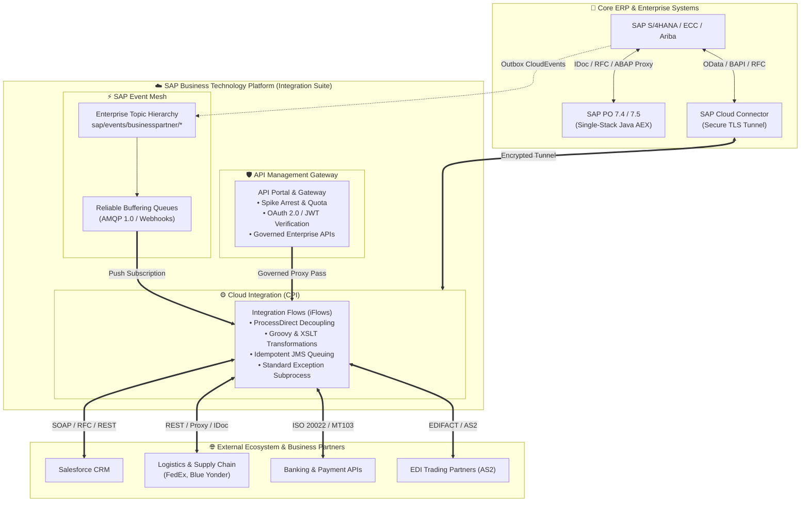

<div align="center">

<a href="https://www.linkedin.com/in/adarshbabumk"></a>

# Hi there, I'm **Adarsh** 👋
### **Tech Lead in SAP Integration**
#### *10+ Years Experience • SAP Integration Suite • SAP PO 7.4 / 7.5 (Single-Stack Java AEX) • Cloud Integration • Event-Driven Architecture*

<p align="center">
  <a href="https://www.linkedin.com/in/adarshbabumk"></a>
  <a href="https://community.sap.com/"></a>
  <a href="mailto:adarshbabumk1@gmail.com"></a>
  
</p>

</div>

---

```yaml
title:             "Tech Lead in SAP Integration"
experience:        "10+ Years Delivering Mission-Critical Enterprise Integration Solutions"
cloud_stack:       ["SAP BTP Integration Suite", "Cloud Integration (CPI)", "API Management", "SAP Event Mesh"]
on_prem_stack:     ["SAP PO 7.4 / 7.5 Single-Stack (Java AEX)", "NetWeaver BPM", "SAP S/4HANA & ECC 6.0"]
standard_adapters: ["SOAP", "RFC", "IDoc", "OData (v2/v4)", "HTTP/HTTPS", "REST/JSON", "ProcessDirect", "JDBC", "ABAP Proxy", "SFTP", "AMQP", "JMS", "Mail", "AS2 / EDI"]
```

---

## 📌 Executive Summary

I am a **Tech Lead in SAP Integration** with over 10 years of extensive experience designing, developing, and managing mission-critical enterprise integration solutions. I specialize in orchestrating end-to-end data flows connecting **SAP core systems (S/4HANA, ECC, Ariba)** and **Non-SAP platforms (Salesforce, Third-Party Banks, Logistics & Supply Chain Providers)**.

My technical leadership spans the complete integration lifecycle:
* **SAP Integration Suite:** Modernizing enterprise landscapes using Cloud Integration (CPI), API Management (APIM), SAP Event Mesh, Open Connectors, and Integration Advisor.
* **SAP Process Orchestration (Java Single-Stack):** Hands-on architecture, development, and administration of **SAP PO 7.4 and 7.5 Single-Stack (Java AEX / NetWeaver BPM)**. Specialized in ESR, Integration Directory (ICO), Java User-Defined Functions (UDFs), and Async-Sync bridges.
* **PO to Cloud Integration Modernization:** Strategy and artifact modernization (ICOs to iFlows, RFC/IDoc to OData/REST, Java UDFs to Groovy Script Collections, and cloud migrations including GCP-hosted PO landscapes).
* **Standard Industry Protocols & Adapters:** Expert-level mastery of standard adapters across SAP Integration Suite and SAP PO, including **SOAP, RFC, IDoc, OData (v2/v4), HTTP/HTTPS, REST/JSON, ProcessDirect, JDBC, ABAP Proxy, SFTP, AMQP, JMS, Mail, and AS2 / EDI (ANSI X12 / EDIFACT)**.

---

## 🛠️ Technology & Skill Matrix

<table>
  <tr>
    <td width="22%" valign="top"><strong>Cloud Integration</strong></td>
    <td width="78%">
      
      
      
      
      
      
    </td>
  </tr>
  <tr>
    <td width="22%" valign="top"><strong>SAP PO (Java Single-Stack)</strong></td>
    <td width="78%">
      
      
      
      
      
      
    </td>
  </tr>
  <tr>
    <td width="22%" valign="top"><strong>Standard Adapters & Protocols</strong></td>
    <td width="78%">
      
      
      
      
      
      
      
      
      
      
      
      
      
      
    </td>
  </tr>
  <tr>
    <td width="22%" valign="top"><strong>Languages & Transformation</strong></td>
    <td width="78%">
      
      
      
      
      
      
    </td>
  </tr>
  <tr>
    <td width="22%" valign="top"><strong>Security & Cloud Platforms</strong></td>
    <td width="78%">
      
      
      
      
    </td>
  </tr>
</table>

---

## 🏛️ Enterprise Architecture Blueprint



---

## 📂 Featured Enterprise Showcase Repositories

Explore my technical reference repositories:

| Repository | Focus Area | Key Concepts Demonstrated | Direct Link |
| :--- | :--- | :--- | :--- |
| 🚀 **[SAP_CPI](https://github.com/adarshbabumk1/SAP_CPI)** | **Cloud Integration & Migration** | Migration assessment principles, Java UDF to Groovy 3.0 conversion, XSLT 3.0 IDoc-to-JSON, dynamic routing, exception subprocess framework, and realistic test payloads. | [Explore Repo →](https://github.com/adarshbabumk1/SAP_CPI) |
| 🛡️ **[sap-api-management-enterprise-hub](https://github.com/adarshbabumk1/sap-api-management-enterprise-hub)** | **API Management** | Production gateway policy bundles (SpikeArrest, Quota, OAuth2, CORS), OpenAPI 3.0 S/4HANA specs, JWT claim extraction, and generic target connections. | [Explore Repo →](https://github.com/adarshbabumk1/sap-api-management-enterprise-hub) |
| ⚡ **[sap-event-mesh-eda-showcase](https://github.com/adarshbabumk1/sap-event-mesh-eda-showcase)** | **Event-Driven Architecture** | CNCF CloudEvents 1.0 specifications, AMQP 1.0 pub/sub simulator, idempotent receiver deduplication, and S/4HANA transactional outbox patterns. | [Explore Repo →](https://github.com/adarshbabumk1/sap-event-mesh-eda-showcase) |
| 🏛️ **[SAP-PO](https://github.com/adarshbabumk1/SAP-PO)** | **SAP PO 7.4 / 7.5 (Single-Stack Java AEX)** | Java AEX ICO governance, File Content Conversion (FCC) cheat-sheets, Java UDF library (ASMA DynamicConfiguration, RFC Lookup, Base64), and BAPI testing data. | [Explore Repo →](https://github.com/adarshbabumk1/SAP-PO) |

---

## 🔄 Architectural Comparison: SAP PO 7.4/7.5 Single-Stack vs. SAP Integration Suite

| Dimension | SAP PO 7.4 / 7.5 Single-Stack (Java AEX) | Modern SAP Integration Suite (CPI / APIM / Event Mesh) |
| :--- | :--- | :--- |
| **Hosting Model** | On-Premises / Hyperscaler IaaS (e.g. GCP-hosted Java AEX) | Managed Multi-Cloud (BTP Cloud Foundry / Hyperscalers) |
| **Configuration Model**| ESR (Interfaces, Mappings) + Integration Directory (ICOs, Channels) | Unified Web Studio (`Design -> Discover -> Monitor`) with BPMN2 iFlows |
| **Custom Code** | Java User-Defined Functions (UDFs) | Apache Groovy 2.4/3.0, JavaScript, and Reusable Script Collections |
| **Routing Pattern** | In-Memory XPath Receiver & Interface Determination | Router steps, Content Modifier, Multicast, Dynamic ProcessDirect |
| **Standard Adapters** | IDoc_AAE, RFC, SOAP, JDBC, File (FCC), REST, Mail, AS2 | IDoc, RFC, SOAP, OData, ProcessDirect, HTTP/REST, JDBC, SFTP, AMQP, JMS, Mail, AS2 |
| **API Governance** | Basic REST Adapter | Dedicated API Management with API Portal, Policies & Developer Portal |
| **Eventing Model** | Polling JDBC/File adapters or IDoc queues | Asynchronous Pub/Sub with SAP Event Mesh (CNCF CloudEvents) |
| **Persistence / Queuing**| Java AEX Message Store, JMS Adapter, XI Message DB | Data Store (Global/Local), Variables, and Managed Cloud JMS Queues |
| **Hybrid Connectivity** | Reverse Proxy / DMZ SAP Web Dispatcher / VPN | Secure outbound-initiated TLS reverse tunnel via **SAP Cloud Connector** |

---

## 📈 GitHub Analytics & Activity

<div align="center">
  
  
</div>

---

## 💬 Connect With Me

* 💼 **LinkedIn:** [Connect with Adarsh on LinkedIn](https://www.linkedin.com/in/adarshbabumk)
* 🌐 **SAP Community:** [View SAP Community](https://community.sap.com/)
* 📧 **Email:** [Send Email directly to Adarsh](mailto:adarshbabumk1@gmail.com)
* 💡 *Always open to discussing Enterprise Integration Strategy, SAP PO-to-CPI migrations, and Event-Driven Architecture.*

<div align="center">
  <sub>Designed with ❤️ for SAP Integration Professionals and the Community</sub>
</div>
